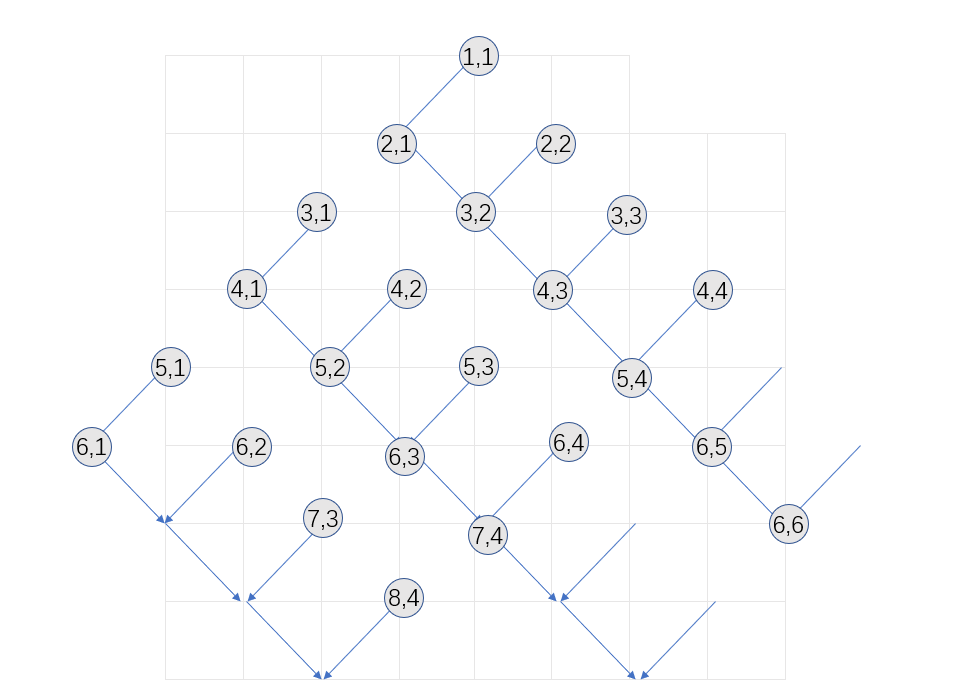

## 1506G Maximize the Remaining String

 [Codeforces Round #710 (Div. 3)](https://codeforces.com/contest/1506)

[题目链接](https://codeforces.com/problemset/problem/1506/G)

题意，找出字符串s的一个子序列s‘，满足s'的字符集等于s的字符集（即每个在s中出现的字符都在s‘中出现），且s'中的每一个字符都是unique，且s'的字典序最大。

QAQ思路不够活跃，想不出来解法，但是我的代码比标答快一个数量级……

从t=空字符串 开始构建s’

每次往t后面push一个字符c，c需要满足：~~我怎么想不到这样构造，一直在想怎么从大到小或者从小到大遍历字符集~~

1. t是s[1...i] 的子序列，且i最小
2. s[j]=c，$j>i$且j最小（贪心）
3. s[j...n] 包含字符集里除了 t之外的所有字符

我们每次选择满足上述条件的最大c，这样最终的s'就是字典序最大的

我的做法时间复杂度是$O(26n\log{n})$

::: details 点击展开
```cpp
#include <bits/stdc++.h>
using namespace std;
typedef long long ll;
int main(int argc, char const *argv[])
{
    ios::sync_with_stdio(false);
    cin.tie(nullptr);
    int t;
    vector<int> q[26];
    cin >> t;
    while (t--)
    {
        string s, t;
        int n = 0;
        set<int> cr;
        cin >> s;
        for (size_t i = 0; i < s.size(); i++)
            q[s[i] - 'a'].push_back(i);
        for (int i = 0; i <= 25; ++i)
        {
            if (q[i].empty())
                continue;
            sort(q[i].begin(), q[i].end());
            n++;
            cr.insert(*q[i].rbegin());// 每个字符出现的最后位置
        }
        int curi = -1;// t是s[1...curi] 的子序列，且curi最小
        for (int i = 0; i < n; ++i)
        {
            for (int j = 25; j >= 0; --j)
            {
                if (q[j].empty())
                    continue;
                //j=q[i][curj],s[j]=c，j>i且j最小
                int curj = lower_bound(q[j].begin(), q[j].end(), curi) - q[j].begin();
                //s[j...n] 包含字符集里除了 t之外的所有字符
                if (cr.empty() || *cr.begin() >= q[j][curj])
                {
                    t.push_back('a' + j);
                    curi = q[j][curj];
                    cr.erase(*q[j].rbegin());
                    q[j].clear();
                    break;
                }
            }
        }
        cout << t << "\n";
    }
    return 0;
}

```
:::
## 1506F. Triangular Paths

 [Codeforces Round #710 (Div. 3)](https://codeforces.com/contest/1506)

[题目链接](https://codeforces.com/problemset/problem/1506/F)

题意比较长……

不好用语言描述，多画几行，不难发现



不难发现图形是很规律的锯齿形，我们可以根据$x = (r-c)/2$判断在第几个锯齿上，根据$y=(r-c)\mod 2$判断在锯齿还是连线上。另外，不能修改箭头朝向，所以只能从上往下进行，所以我们先按照r排序，然后分类讨论。

如果 $x_1 = x_2$

1. $y_1 =1, y_2 = 0$，即从连线到锯齿，不能到达。比如2,1到2,2或者3,3

2. $y_1 = y_2 = 0$，不能直接到达，此时必须不断修改锯齿的朝向，比如1,1到3,3只能1,1到2,2到3,3（由1可知，到2,1不能到3,3）,花费是$r_2 - r_1$
3. 其他情况都快直接到达，花费0

如果 $x_1 \ne x_2$，花费是$x_2 - x_1$,即每跨一个花费为1，比如2,1到3,1。2,1到6,4可以先从2,1到5,4再到6,4，花费还是1

::: details 点击展开
```cpp
#include <bits/stdc++.h>

using namespace std;
#ifdef DEBUG
const int ms = 100 + 5;
#else
const int ms = 2e5 + 5;
#endif
typedef long long ll;

pair<int, int> a[ms];

int main(int argc, char const *argv[])
{
    ios::sync_with_stdio(false);
    cin.tie(nullptr);
    int t;
    cin >> t;
    while (t--)
    {
        int n;
        cin >> n;
        for (size_t i = 0; i < n; i++)
        {
            cin >> a[i].first;
        }
        for (size_t i = 0; i < n; i++)
        {
            cin >> a[i].second;
            a[i].second = a[i].first - a[i].second;
        }
        sort(a, a + n);
        int res = 0, c1 = 0, e1 = 0, r = 1;
        for (size_t i = 0; i < n; i++)
        {
            int c2 = a[i].second / 2, e2 = a[i].second % 2;
            if (c1 != c2)
            {
                e1 = 0;
                res += c2 - c1;
            }
            else if (e1 == 0 && e2 == 0 && c1 == c2)
            {
                res += a[i].first - r;
            }
            c1 = c2, e1 = e2, r = a[i].first;
        }
        cout << res << "\n";
    }

    return 0;
}

```
:::

## 1495B Let's Go Hiking

[Codeforces Round #706 (Div. 1)](https://codeforces.com/contest/1495)

[题目链接](https://codeforces.com/problemset/problem/1495/B)

A和B做游戏，有一个排列P，长度为n，AB一开始各选择一个位置x,y，A先手，A只能往比他当前小的地方走，B只能往比他当前小的地方走，A和B的位置不能重复，问有哪些位置A先手必赢。

首先排除首尾，B站A旁边就卡死了。

因为P是排列，所以P可以抽象成$\nearrow\searrow\nearrow\searrow$，AB只能在一个坡上走，不能掉头，不能到另一个坡

我们可以排除除了峰顶的所有位置，考虑A站在$\nearrow$上，B站在A旁边直接卡死，$\searrow$同理

站在峰顶上，如果峰顶两侧的长度不同，B只需要站在长坡上，距离峰顶位置大于短坡长度的奇数位置，A必输，比如`1,2,4,3`,A站在P[3]=4，B只需要站在P[2]=2即可，由于峰顶两侧的长度不同，必存在这样的奇数位置。

如果峰顶两侧的长度相同且都为奇数，B只需要站坡底，A必输 比如`1,2,3,7,6,5,4`

如果峰顶两侧的长度相同且都为偶数，B和A站在同一个坡上必输，这时候需要考虑其他坡有没有长度大于等于当前坡的。

::: details 点击展开
```cpp
#include <bits/stdc++.h>

using namespace std;

typedef long long ll;
#ifdef DEBUG
const int ms = 100 + 5;
#else
const int ms = 2e5 + 5;
#endif

int a[ms];
// 以i为起点,往左下降的长度，右下降的长度,i左边最长的坡长度,右边的坡长度
int dl[ms], dr[ms], mdl[ms], mdr[ms];
bool check(int i)
{
    if (dl[i] == 0 || dr[i] == 0)
        return false; // 单边为0不行
    int m = max(dl[i], dr[i]);
    if (dl[i] != dr[i])
        return false; // 不等必输
    // 偶数且坡最长
    return (m % 2 == 0) && max(mdl[i - dl[i]], mdr[i + dr[i]]) < m;
}
int main(int argc, char const *argv[])
{
    ios::sync_with_stdio(false), cin.tie(nullptr);
    int n;
    cin >> n;
    if (n <= 2)
    {
        cout << "0\n";
        return 0;
    }
    for (size_t i = 0; i < n; i++)
    {
        cin >> a[i];
        if (i > 0)
        {
            if (a[i] > a[i - 1])
            {
                dl[i] = dl[i - 1] + 1;
            }
            mdl[i] = max(dl[i], mdl[i - 1]);
            mdr[i - dl[i]] = max(mdr[i - dl[i]], dl[i]);
        }
    }
    for (int i = n - 2; i >= 0; i--)
    {
        if (a[i] > a[i + 1])
        {
            dr[i] = dr[i + 1] + 1;
        }
        // 1 2 3 7 6 5 4 对于1上升和下降都要考虑到。l同理
        mdr[i] = max(mdr[i], max(dr[i], mdr[i + 1]));
        mdl[i + dr[i]] = max(mdl[i + dr[i]], dr[i]);
    }
    int res = 0;
    for (size_t i = 1; i < n - 1; i++)
    {
        if (check(i))
        {
            res++;
        }
    }
    cout << res << "\n";
    return 0;
}

```
:::
