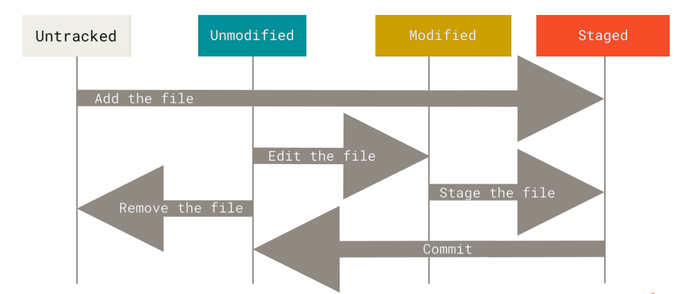

## 配置

命令 `git config`

配置文件有三个层级,每一个级别会覆盖上一级别的配置 ：

1. `/etc/gitconfig` 文件: 包含系统上每一个用户及他们仓库的通用配置。对应`--system  ` 选项  
2. `~/.gitconfig` 或 `~/.config/git/config` 文件：只针对当前用户 。对应`--global`  选项  
3. 当前使用仓库的 Git 目录中的 config 文件（即 `.git/config`）：针对该仓库。  对应`--local`  选项

`git config <key>`： 来检查 Git 的某一项配置 ,加上`--show-origin  `可以查看最终是哪个文件起效。

## 初始化

这个没啥说的

```sh
git init
git add *.c
git commit -m 'initial project version'
```

## 记录更新

状态转移图



`git status` 查看哪些文件处于什么状态。`--short  `缩短输出，输出中有两栏，左栏指明了暂存区的状态，右栏指明了工作区的状态 。

`git add <files> ` 开始跟踪对应文件 

`.gitignore   `文件，列出要忽略的文件的模式  （glob 模式匹配  ）。[gitignore模板](https://github.com/github/gitignore )

`git diff  ` 具体了解修改了什么地方。

不加参数比较的是工作目录中当前文件和暂存区域快照之间的差异  

`--staged   `将比对已暂存文件与最后一次提交的文件差异  

`git commit ` 提交

`git rm --cached  ` 从暂存区删除 (cached 和staged是同义词……)

## 查看提交历史

`git log`

默认会按时间先后顺序列出所有的提交  

`-p or --patch`显示每次提交所引入的差异  

操作格式的还有一些，用到再说吧……


## 撤销操作

`git commit --amend  ` 

使用场景：提交完了才发现漏掉了几个文件没有添加，或者提交信息写错了  

```shell
git commit -m 'initial commit'
git add forgotten_file
git commit --amend
```

最终只会有一个提交——第二次提交将代替第一次提交的结果  ,第一次提交不会出现在仓库的历史上。

`git rm --cached  ` 取消暂存的文件

`git reset HEAD <file>  ` 也可以取消暂存的文件，本质是重置，比较危险，老版git会提示这个，新版换成上面的了

`git checkout -- <file>  ` 将工作目录的文件回退到暂存区的版本

新版 git 使用`git restore <file>` 替代这个命令


## 远程仓库


`git remote -v  ` 显示  远程仓库的简写和url

`git remote add <shortname> <url>  `添加一个新的远程 Git 仓库  

`git fetch <remote>  ` 从远程仓库中  拉取所有你还没有的数据  (pull会自动合并分支，fetch不会)

`git push <remote> <branch>  ` 推送到远程仓库

`git remote rename   ` 重命名简写

## 标签

`git tag  ` 列出标签

`git tag -l "v1.8.5*"  ` 列出匹配的标签


Git 支持两种标签：轻量标签（lightweight）与附注标签（annotated）  

轻量标签很像一个不会改变的分支——它只是某个特定提交的引用  

`git tag v1.4-lw ` 即可


附注标签是存储在 Git 数据库中的一个完整对象  

`git tag -a v1.4 -m "my version 1.4  `


`git tag -a v1.2 9fceb02  `对过去的提交打标签  

`git push origin <tagname>  ` 推送标签到远程仓库

`git tag -d <tagname>  ` 删除本地标签

`git push origin --delete <tagname>  ` 删除远程标签