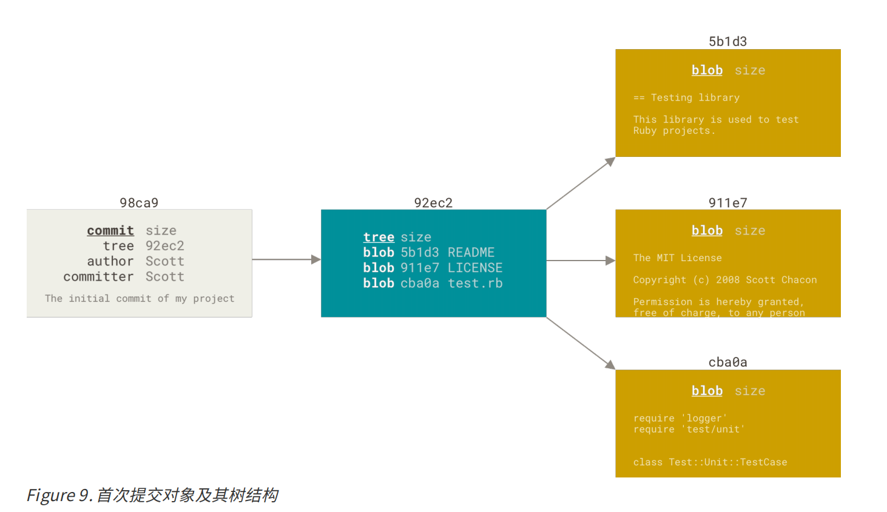
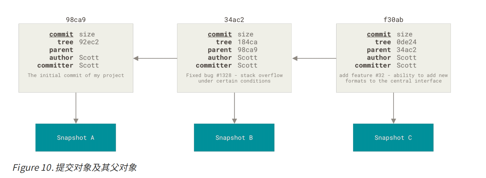
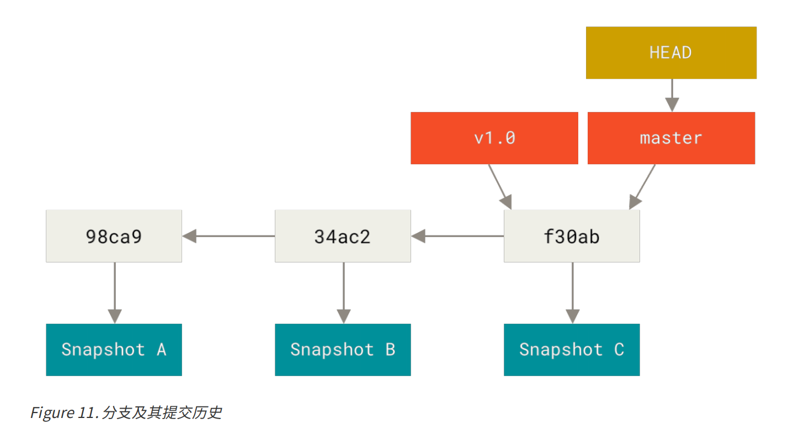
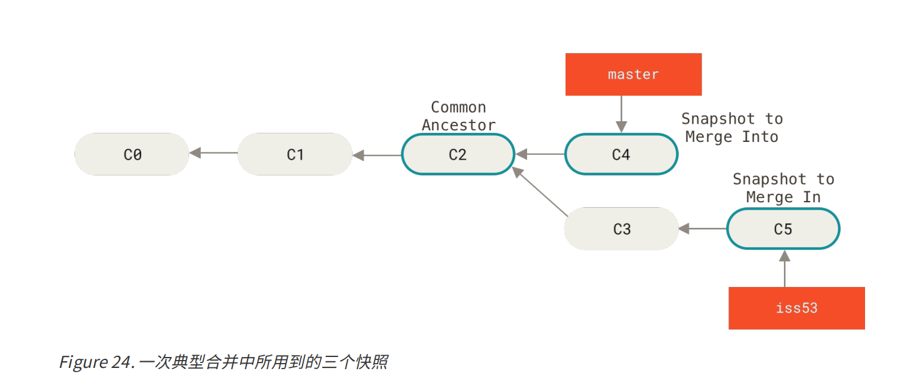
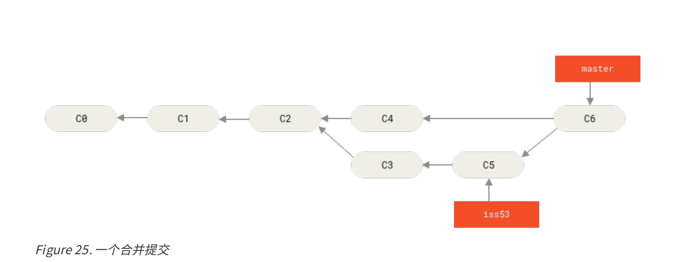
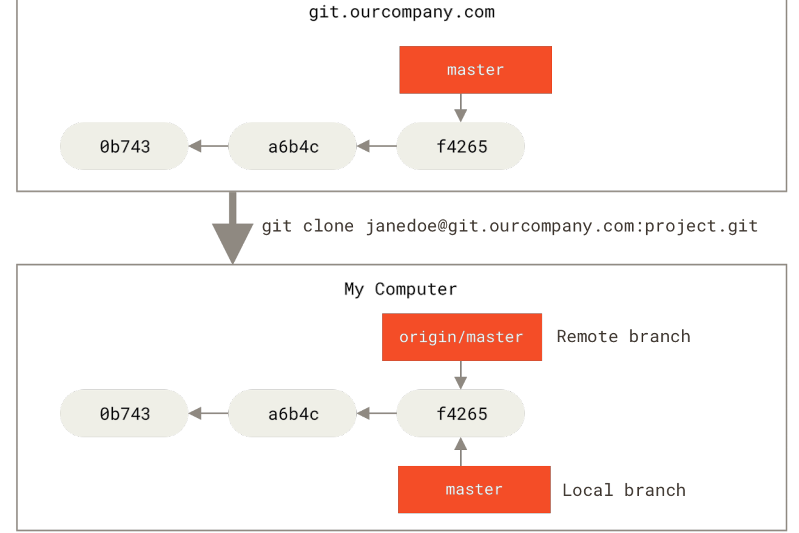
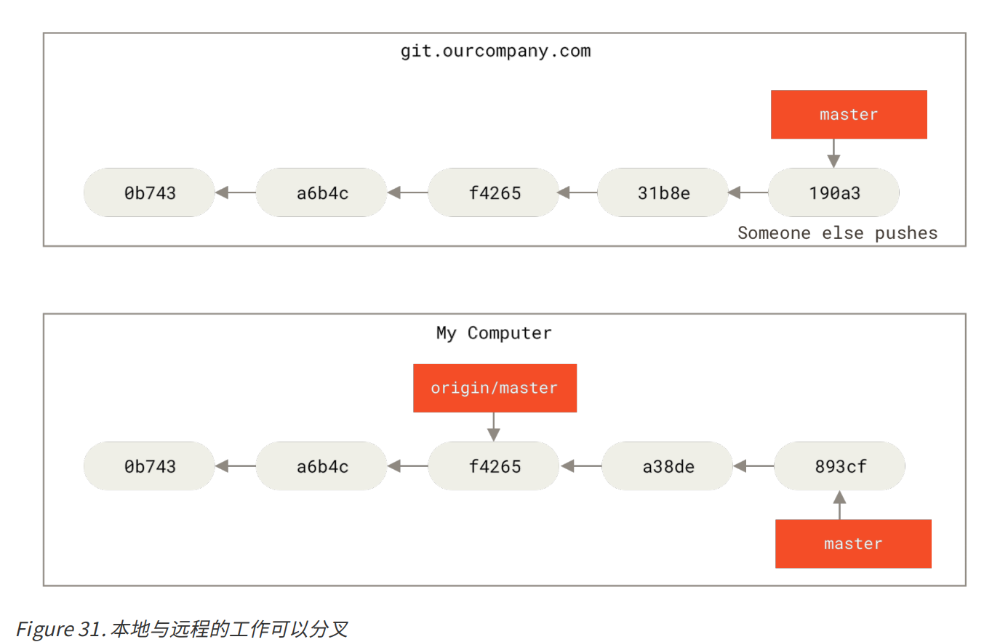
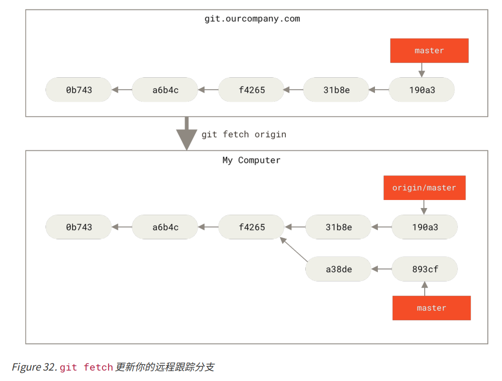

## 分支简介

Git 保存的不是文件的变化或者差异，而是一系列不同时刻的 **快照** (snapshot),

当你进行一次提交时，Git 会保存一个提交对象（commit object）。	

如下图所示，当你将文件添加到暂存区的时候，git为每一个文件计算校验和 ，然后会把当前版本的文件快照（blob Binary Large Object对象）保存到Git 仓库中  。

当使用 git commit 进行提交操作时，Git 会先计算每一个子目录（本例中只有项目根目录）的校验和， 然后在 Git 仓库中这些校验和保存为树对象。随后，Git 便会创建一个提交对象， 包含作者的姓名和邮箱、提交时输入的信息以及指向它的父对象（上一次的提交对象）的指针  ，指向这个树对象（项目根目录）的指针。   

 

Git 的分支 （标签也是），事实上就是就是指向提交对象的指针

## 分支创建、切换、合并

`git branch  <name>` 创建一个name分支，也就是在当前的提交对象上添加一个指针。

`HEAD  ` 是一个特殊指针，指向当前所在的本地分支  

`git checkout  <name>`切换到name分支，也就是`HEAD`修改为指向对应分支

但是checkout歧义较多，新版本提供了`git switch <name>`切换分支

需要注意的是，分支切换会改变你工作目录中的文件 ，如果有文件修改未提交，会导致无法切换，最好在切换分支之前，保持好一个干净的状态。有两种办法解决这个问题，贮藏  （stashing） 和 修补提交（commit amending） 。

___

贮藏  类似于一个栈：

`git stash push  ` 跟踪文件的修改与暂存的改动 存储到栈上，文件回到上一次提交的状态，你可以在任意一个分支上应用这些修改

`git stash list  ` 查看

`git stash apply  ` 应用最新修改（会产生合并冲突  ）。`git stash apply stash@{2}  ` 应用一个旧的修改

`git stash drop  <name>`移除

`git stash pop   ` 应用最新修改并移除

___

`git branch -d   <name>` 删除分支

`git merge <name>  ` 将name分支合并到当前分支

合并有两种情况，如果没有冲突的话：

一种是合并的分支是当前分支的后继，， 如果顺着一个分支走下去能够到达另一个分支，那么 Git 在合并两者的时候， 只会简单的将指针向前推进（指针右移），因为这种情况下的合并操作没有需要解决的分歧——这就叫做 “快进（fast-forward）”  

另一种是从某个历史节点分叉开来 ，当前分支所在提交  不是目标提交的祖先，Git 会使用两个分支的末端所指的快照  以及这两个分支的公共祖先  做一个简单的三方合并  

Git 将此次三方合并的结果做了一个新的快照并且自动创建一个新的提交指向它  

有时候合并操作不会如此顺利 ，比如在两个分支里面都修改了一个文件，这时候可能会产生合并冲突。

这时`git status  `会显示冲突文件

我用vsc，插件会帮助你查看、合并冲突（有概率抽风）

## 远程分支  

远程跟踪分支是远程分支状态的引用，以 `<remote>/<branch>` 的形式命名  

比如下面的例子，clone一个仓库，Git 的 clone 命令会为你自动将其命名为 origin，拉取它的所有数据， 创建一个指向它的 master 分支的指针，并且在本地将其命名为 origin/master。 Git 也会给你一个与 origin 的master 分支在指向同一个地方的本地 master 分支  

如果你在本地的 master 分支做了一些工作，在同一段时间内有其他人推送提交到 git.ourcompany.com并且更新了它的 master 分支，这就是说你们的提交历史已走向不同的方向。 即便这样，只要你保持不与origin 服务器连接（并拉取数据），你的 origin/master 指针就不会移动。  

`git fetch <remote>  `与给定的远程仓库同步数据  

`git push <remote> <branch>  ` 推送到远程分支

`git push origin xx:yy  `将本地的 xx 分支推送到远程仓库上的 yy分支  。上面的命令其实是简写，xx和yy同名。

`git checkout -b <branch> <remote>/<branch>  ` 创建一个本地分支并跟踪远程分支

`git checkout --track <remote>/<branch>  ` 同样的效果，不过分支同名

`git checkout  <branch>` 如果你尝试检出的分支 (a) 不存在且 (b) 刚好只有一个名字与之匹配的远程分支，那么 Git 就会为你创建一个跟踪分支  

`git branch -u   <remote>/<branch>  ` 为已经存在的分支显示设置跟踪的远程分支。

`git pull  ` 拉取分支，比较复杂，相当于fetch + merge，简单情况下可以用pull，复杂情况下还是fetch和merge单独用

`git push <remote> --delete <branch>  `删除远程分支

## 变基rebase  

rebase的目的和merge类似，`git rebase <branch>`提取目标分支的变更应用到当前分支，并创建一个新分支。优点是使得提交历史更加整洁 。

个人感觉有点魔法了，官网有一句话

> 如果提交存在于你的仓库之外，而别人可能基于这些提交进行开发，那么不要执行变基。  

感觉比较看团队风格，个人不太喜欢，如果有需要的话再仔细学学吧。